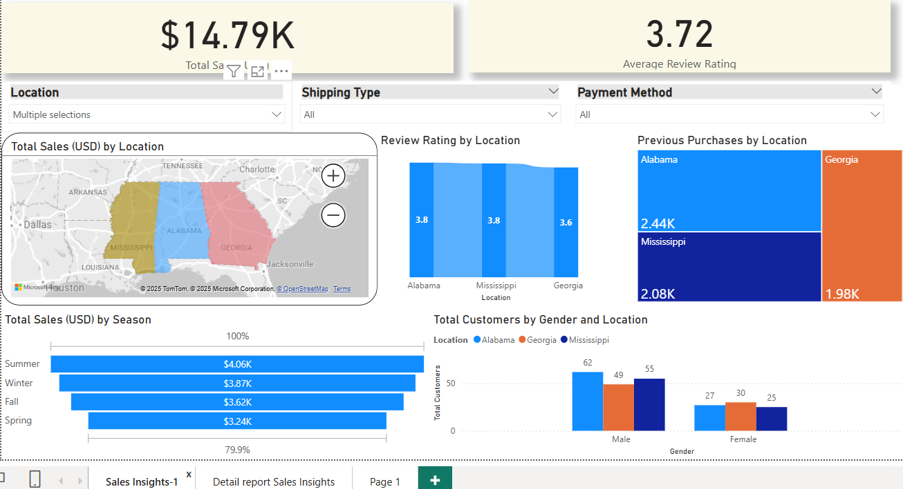

# 🛒 Retail Sales Analysis Dashboard

This project presents a comprehensive **Retail Sales Analysis** using Power BI, leveraging DAX functions and interactive visuals to deliver actionable insights into customer behavior, product performance, and regional sales trends.

## 📊 Project Overview

The analysis is based on retail transaction data and aims to answer key business questions such as:

- What products are selling the most?
- Which states are generating the highest revenue?
- What payment methods are most popular?
- How do loyalty program members compare to non-members in terms of spending?
- How have sales trended over time (yearly and seasonally)?
- In which **season** do we see the highest sales activity?

## 📁 Files in This Repository

- `Retail_Sales EDA.xlsx`: Preprocessed dataset used for the dashboard.
- `retail_sales_dashboard.pbix`: Power BI dashboard file containing all visuals and DAX measures.

## 🧠 Key Features

- **State-wise Analysis**: Visual breakdown of total sales by state.
- **Customer Segmentation**: Insights into loyalty program member vs non-member behavior.
- **Time-Series Analysis**: Year-over-year performance with monthly and quarterly breakdowns.
- **Seasonal Sales Trends**: Identification of peak seasons (e.g., **Winter and Holiday season**) with the highest sales.
- **Payment Method Trends**: Insights into customer preferences for cash, credit, or digital payments.
- **Product-Level Drilldowns**: Top-performing product categories and individual SKUs.

## 🛠 Tools & Technologies

- **Power BI**: For data modeling, DAX, and interactive dashboard creation.
- **DAX (Data Analysis Expressions)**: Used for creating seasonal groupings and advanced metrics.
- **Excel**: For initial data cleaning and exploratory data analysis (EDA).

## 📈 Business Impact

This dashboard empowers retail stakeholders to:
- Optimize seasonal marketing and promotional campaigns based on peak sales periods.
- Manage inventory more efficiently with product and region-level insights.
- Strengthen customer engagement through loyalty behavior patterns.
- Streamline transaction systems by tracking payment preferences.

## 📸 Dashboard Preview

## ✅ Getting Started

To explore the dashboard:
1. Clone or download this repository.
2. Open the `retail_sales_dashboard.pbix` file in Power BI Desktop.
3. Interact with slicers and visuals to uncover trends by state, year, season, product, and customer segment.

---

